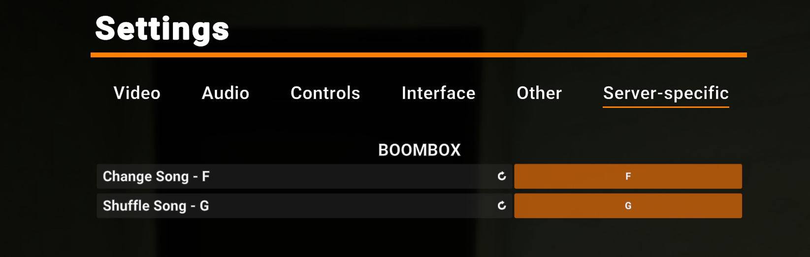

# Boombox

This plugin offers a Radio-based CustomItem (The JBL Speaker a.k.a. "Boombox") that plays music or other audio for players within proximity to enjoy.

## In-game usage

**IMPORTANT:** Be sure to bind the server-specific Boombox keys to use it properly.


The Boombox appears to be a larger-than-usual guard radio. By default it spawns in the SCP-914 room, but this can be changed via config. 

Uses:
- Use the Boombox like you would any normal radio.
- Turning it ON should begin to play the first song in the first playlist. Turning it OFF will pause the playback. 
- Change the radio frequency/range to change playlists, the config has a different playlist option for each range. 
- Press the Change Song key to cycle to the next song in the current playlist. 
- Press the Shuffle Song key to switch to a random song in the entire set of playlists/songs.

## Installation / Depedencies

Main dependencies:
- [EXILED](https://github.com/ExMod-Team/EXILED)
- [AudioPlayerApi](https://github.com/Killers0992/AudioPlayerApi) (also requires NVorbis.dll)

This plugin uses Exiled so .dlls must be installed in the normal locations. Unless your server uses non-standard paths, assume that `%EXILED%` refers to the path where Exiled is normally installed: `C:\Users\%UserName%\AppData\Roaming\EXILED`.
1. Download the files from the latest release
1. Place `Boombox.dll` in `%EXILED%\Plugins\`
1. Unzip `dependencies.zip` and place all .dlls in `%EXILED%\Plugins\dependencies`

## Configuration

The `.yml` config file will be generated in the standard location if it does not exist yet: `%EXILED%\Configs\Plugins\Boombox\<server-port>.yml`.

Most of the config properties are fairly self-explanatory and have descriptions. The easter egg is an exception, I would not recommend it by default but if you're curiuos you'll just have to try it. :)

However, the Boombox really does not do very much unless you add some audio files to the config and the audio-file location.

### Adding audio files

This plugin uses AudioPlayerApi for playing music, so the standard requirements for that library apply here as well. Specific requirements:
1. Format: `.ogg`
1. Channels: 1 (Mono)
1. Frequency: 48kHz (48,000 Hz)
See [AudioPlayerApi](https://github.com/Killers0992/AudioPlayerApi) for extra details and a recommended converter.

Place your .ogg files in this directory: `%EXILED%\Audio\Boombox`. You may have to create the directory first. I am planning on making the path configurable soon as well.

Then, in the config, just reference them by their filename. For example:
```yml
boombox:
  # other boombox fields...

  playlists:
    Short:
      name: 'Playlist #1'
      songs:
      - 'example_song.ogg'
      - 'example_song_2.ogg'
    # other playlists...
```

## Other notes

#### Limitations and issues

1. Standard limitations of playing audio via AudioPlayerApi
1. Currently there is a hard-coded limit of 1 Boombox instance. If you try to raise the `limit` in `spawn_properties`, the plugin will throw an exception before it is enabled. I have never tested with multiple but I plan to add that in the future.

#### Contributing

Send me a DM on Discord if you're interested: `@reidiculous69`