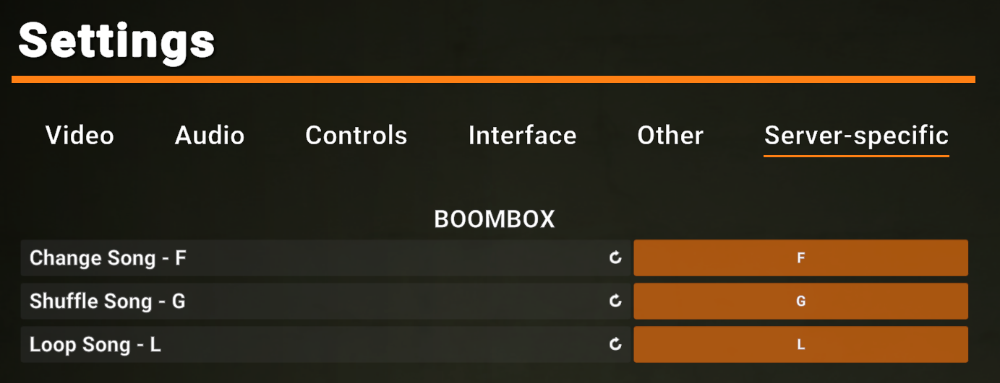

# Boombox

This plugin offers a Radio-based CustomItem (The JBL Speaker a.k.a. "Boombox") that plays music or other audio for players within proximity to enjoy.

## Important Notes

Be sure to bind the server-specific Boombox keys to use it properly. Or, you can use console commands from the command system described in the next section.


Audio files must be `.ogg` format, `48000 Hz` frequency, and `Mono` channels. Use [this free website](https://audio.online-convert.com/convert/mp3-to-ogg),
you should not need to change any settings besides what is in the picture. More info in the audio section below.


## In-game usage

The Boombox appears to be a larger-than-usual guard radio. By default it spawns in the SCP-914 room, but this can be changed via config. 

Uses:
- Use the Boombox like you would any normal radio.
- Turning it ON should begin to play the first song in the first playlist. Turning it OFF will pause the playback, and turning it ON again will resume.
- Change the radio frequency/range to change playlists, the config has a different playlist option for each range. 
- Press the Change Song key to cycle to the next song in the current playlist. 
- Press the Shuffle Song key to switch to a random song in the entire set of playlists/songs.
- Press the Toggle Loop key to toggle what happens when a song ends. This is similar to apps like Spotify and has the following modes:
  1. `None`: the playback stops when the song ends.
  1. `RepeatSong`: the playback repeats the current song indefinitely.
  1. `CyclePlaylist`: the playback will cycle through the songs in the current playlist indefinitely.
  1. `ShuffleAll`: the playback will shuffle to a new random song indefinitely.

#### Console Commands

As an alternative to Server-Specific Settings keybinds, you can use console commands from the client console (opened with ` button).

While holding a Boombox that is On, you can use the following console commands:
1. `.boombox change` => Change Song
1. `.boombox shuffle` => Shuffle Song
1. `.boombox loop` => Toggle Loop

You can also use `.bb` instead as a shorthand. Please note that for some reason, the commands are not recognized unless they start with a `.` character.

## Installation / Depedencies

Main dependencies:
- [EXILED](https://github.com/ExMod-Team/EXILED)
- [AudioPlayerApi](https://github.com/Killers0992/AudioPlayerApi) (also requires NVorbis.dll to function)

This plugin uses Exiled so .dlls must be installed in the normal locations. 
1. Unless your server uses non-standard paths, `%EXILED%` => normal Exiled locations:
    1. Windows: `C:\Users\%UserName%\AppData\Roaming\EXILED`
    2. Linux: `~/.config/EXILED`
2. Download the files from the latest release
3. Place `Boombox.dll` in `%EXILED%\Plugins\`
4. Unzip `dependencies.zip` and place all .dlls in `%EXILED%\Plugins\dependencies`

## Configuration

The `.yml` config will be generated if it doesn't exist: `%EXILED%\Configs\Plugins\Boombox\<server-port>.yml`.

Most of the config is self-explanatory and does not really need to be changed for it to function properly.

However, the Boombox really does not do very much unless you add some audio files to the config and the audio-file location.

### Adding audio files

#### MP3 to OGG conversion

This plugin uses AudioPlayerApi for playing music, so the standard requirements for that library apply here as well. Specific requirements:
1. Format: `.ogg`
1. Channels: 1 (Mono)
1. Frequency: 48kHz (48,000 Hz)
See [AudioPlayerApi](https://github.com/Killers0992/AudioPlayerApi) for more details.

I recommend using [this free website](https://audio.online-convert.com/convert/mp3-to-ogg).

#### Configuring audio files

You have two options for the location of audio files in the config:
1. Leave the `audio_path:` field blank (default), and create a directory at the default location: `%EXILED%\Audio\Boombox`.
1. Set the `audio_path:` field in the config to a different path with audio files instead.

Then, in the config, just reference them by their filename. For example:
```yml
boombox:
  playlists:
    Short:
      name: 'Playlist #1'
      songs:
      - 'example_song_1.ogg'
      - 'example_song_2.ogg'
    # other playlists...
```

#### Easter Egg

I would NOT recommend using this by default, it's more of a personal feature for my own server.

If enabled, it will trigger a facility warhead shake effect when the conditions are met:
1. The configured EasterEggPlayer starts playing the configured EasterEggSong
1. After the EasterEggDelay (seconds), if the song has not changed or stopped, the warhead effect will trigger.
1. This can only be done once per round

Note that this does not actually nuke the facility, it is just the visual shake effect, nobody will take damage. However it's a bit buggy still so you've been warned :)

## Other notes

#### Limitations and issues

1. Standard limitations of playing audio via AudioPlayerApi
1. Like other plugins that use AudioPlayerApi, this plugin may cause conflicts with certain other plugins related to radio and/or voice communication patching
  - e.g. ChaosRadio, ScpProximity, etc.
1. Boomboxes on the ground (as Pickups) will play transmitted Radio messages like a normal radio
  - I plan on fixing this via Harmony patching in the future, however this will likely cause further conflicts with plugins mentioned above

#### Contributing

Send me a DM on Discord if you're interested: `@reidiculous69`
